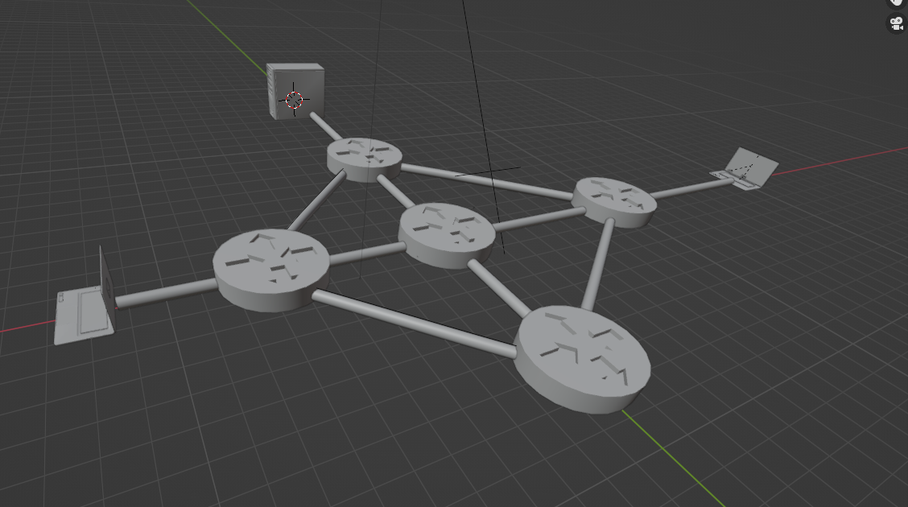
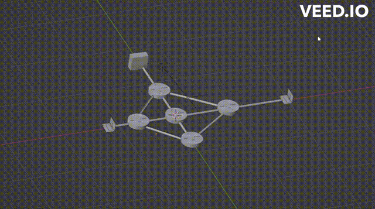
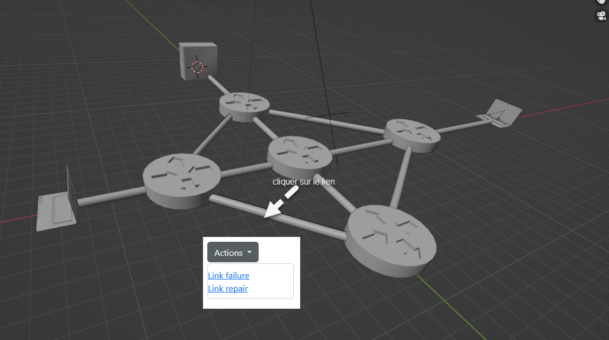
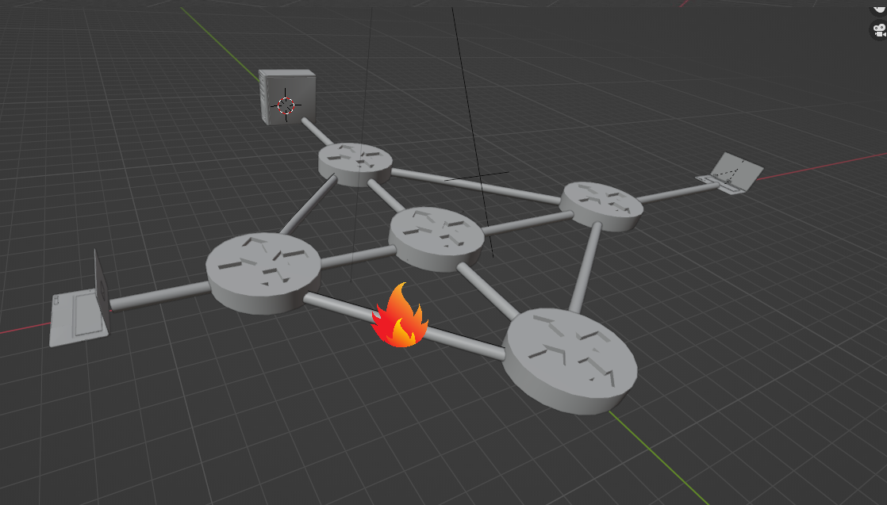
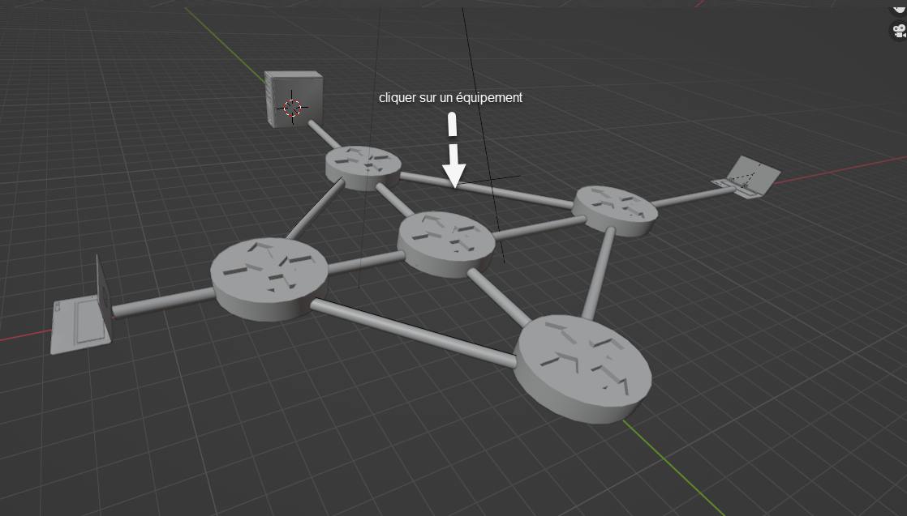
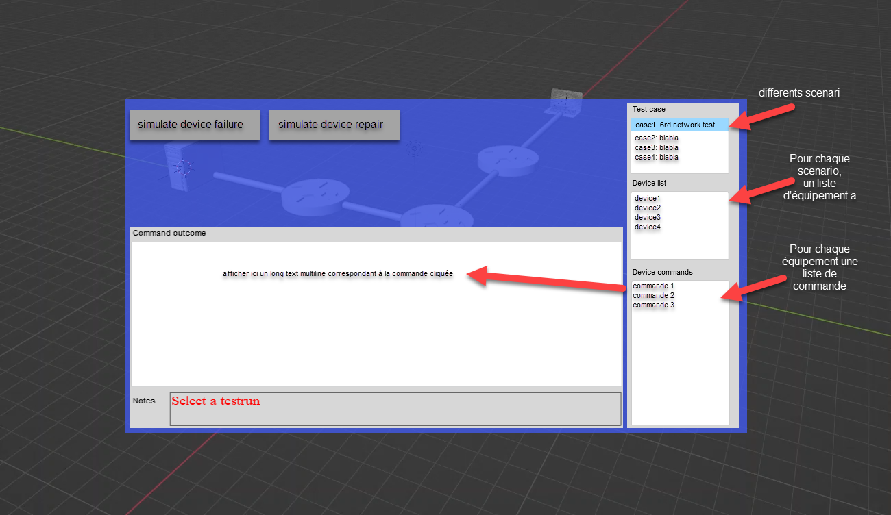
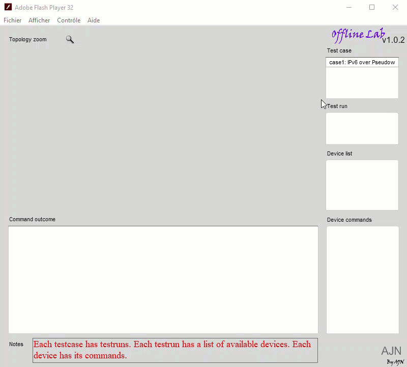
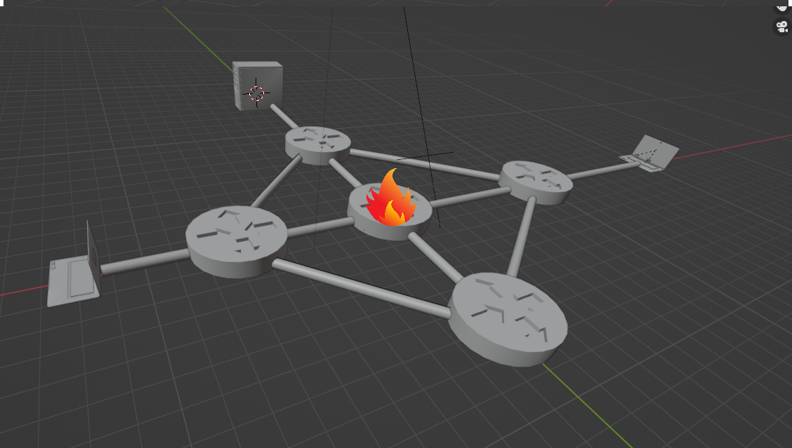

la scène représente un ensemble d'équipements interconnectés par des "tubes" (connexions).

Il n'y aura pas de challenge pour l'utilisateur, si "exit" est appuyé, le "jeux" se termine.

Un trafic qui représente des données circulent à travers ces tubes. Ce trafic pourrait être représenté par une animation d'objets (ou particules) qui bougent d'un équipement vers un autre.
L'animation sera déclanché en appuyant sur un boutont "traffic animation"

L'utilisateur devrait être capable de changer la vu comme sur Unity/Blender, mais avec des limites de mouvement de la caméra, comme le montre l'animation ci-dessous:

#### Cliquer sur un lien
Si on clique sur un lien, un menu contextuel s'ouvre pour montrer les actions possibles sur un lien (simulter une coupure du lien / ou réparer le lien):

- link failure > fait afficher un feu sur le lien
- link repair > fait "réparer" le lien (remet à l'état initiale)

#### Cliquer sur un équipement

Si on clique sur un équipement

un UI s'ouvre pour montrer les actions possibles sur un équipement :

C'est ce que montre un ancien projet sur flash animation:

Une fois le "jeu" commence ou si l'utilisateur évoque le UI d'un équipement, les données sont chargées dynamiquement à partir d'un fichier JSON:

    {
    "mycase": {
        "id": "1",
        "casename": "case1: IPv6 over Pseudowire (AToM)",
        "router": [
        {
            "id": "P",
            "command": [
            {
                "cmdname": "sh ip ospf database",
                "cmdfile": "C0_TR0_IT1_P_sh_ip_ospf_database"
            },
            {
                "cmdname": "sh ip ospf ne",
                "cmdfile": "C0_TR0_IT1_P_sh_ip_ospf_ne"
            },
            {
                "cmdname": "sh ip ospf inter",
                "cmdfile": "C0_TR0_IT1_P_sh_ip_ospf_inter"
            },
            {
                "cmdname": "sh ip ospf border-routers",
                "cmdfile": "C0_TR0_IT1_P_sh_ip_ospf_border-routers"
            }
            ]
        },
        {
            "id": "PE2",
            "command": [
            {
                "cmdname": "sh mpls l2transport vc 242 detail",
                "cmdfile": "C0_TR0_IT1_PE2_sh_mpls_l2transport_vc_242_detail"
            },
            {
                "cmdname": "sh mpls l2transport vc 241 detail",
                "cmdfile": "C0_TR0_IT1_PE2_sh_mpls_l2transport_vc_241_detail"
            },
            {
                "cmdname": "sh mpls l2transport vc 24 detail",
                "cmdfile": "C0_TR0_IT1_PE2_sh_mpls_l2transport_vc_24_detail"
            },
            {
                "cmdname": "sh mpls l2transport vc 242",
                "cmdfile": "C0_TR0_IT1_PE2_sh_mpls_l2transport_vc_242"
            }
            ]
        },
        {
            "id": "PE1",
            "command": [
            {
                "cmdname": "sh mpls l2transport vc 242 detail",
                "cmdfile": "C0_TR0_IT1_PE1_sh_mpls_l2transport_vc_242_detail"
            },
            {
                "cmdname": "sh mpls l2transport vc 241 detail",
                "cmdfile": "C0_TR0_IT1_PE1_sh_mpls_l2transport_vc_241_detail"
            },
            {
                "cmdname": "sh mpls l2transport vc 24 detail",
                "cmdfile": "C0_TR0_IT1_PE1_sh_mpls_l2transport_vc_24_detail"
            },
            {
                "cmdname": "sh mpls l2transport vc 242",
                "cmdfile": "C0_TR0_IT1_PE1_sh_mpls_l2transport_vc_242"
            },
            {
                "cmdname": "sh tech-support",
                "cmdfile": "C0_TR0_IT1_PE1_sh_tech-support"
            },
            {
                "cmdname": "sh arp",
                "cmdfile": "C0_TR0_IT1_PE1_sh_arp"
            }
            ]
        }
        ]
    }
    }

pareil que pour un lien (tube), si l'utilisateur choisi de simuler une panne de l'équipement, une animation de feu se déclanche sur l'équipement en question:

